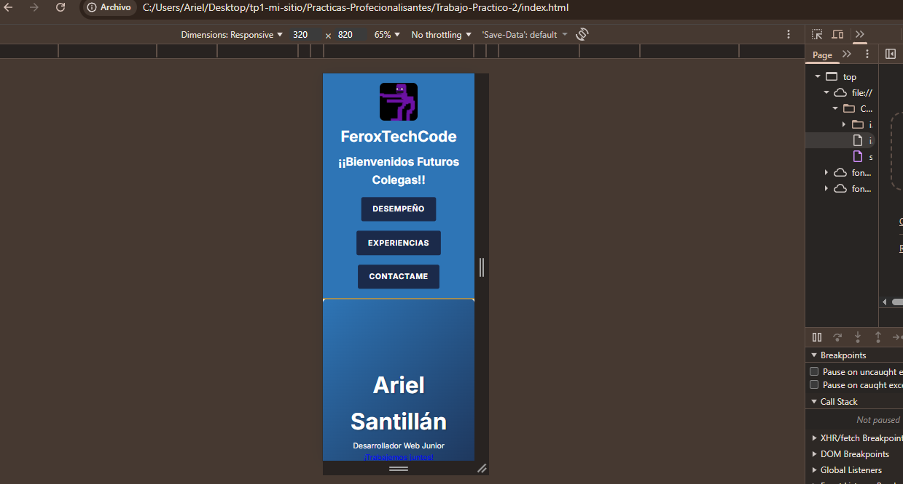
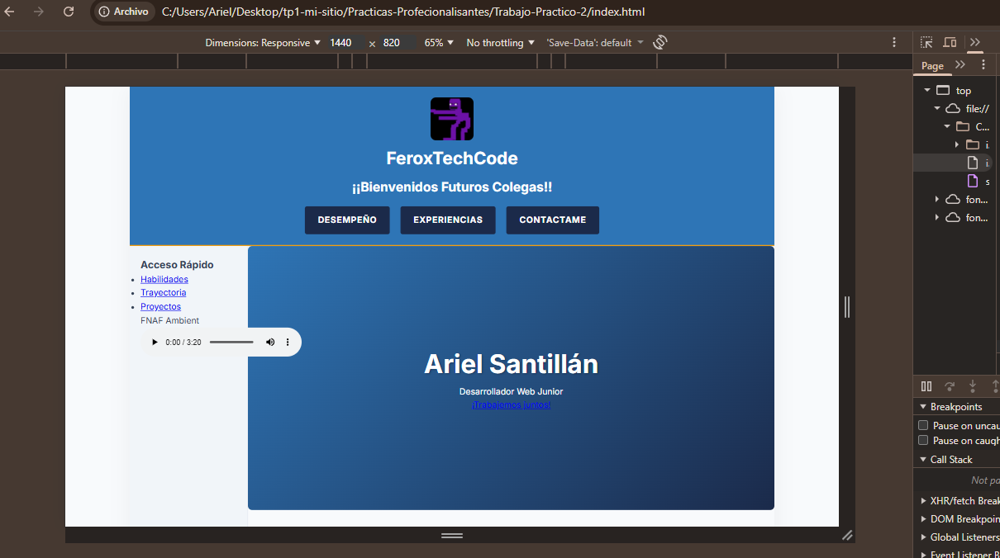
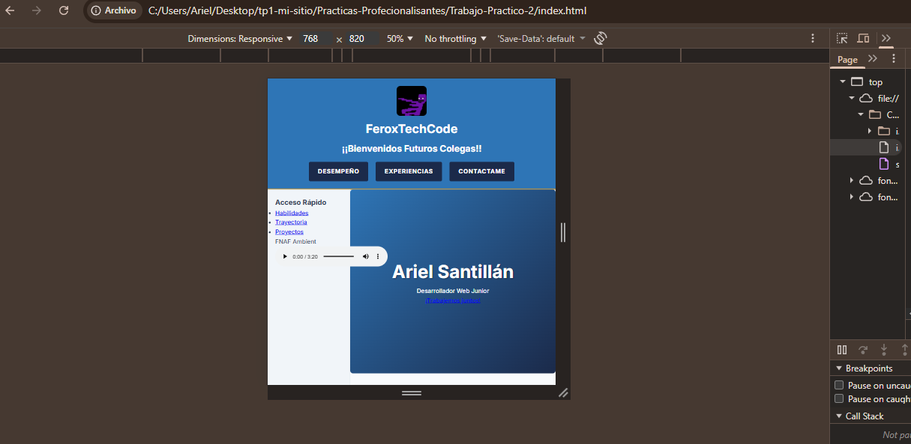

# Ariel Santillán | FeroxTechCode - Portfolio Profesional

### Descripción del Proyecto
Este sitio es el resultado del **TP Integrador de Prácticas Profesionalizantes II**. Se trata de un portfolio personal con una estética inspirada en el "Hombre Púrpura" (FNAF), diseñado bajo la filosofía **Mobile-First**. El objetivo principal fue demostrar el dominio de maquetación avanzada, pasando de un diseño base para celulares a un layout complejo de escritorio sin perder la coherencia visual.

### Sitio en Vivo !!
Podés ver el resultado final aquí: [https://github.com/FeroxTechCode/Ariel-Santillan-mi-sitio-web-plus-Ultra]

### Tecnologías Aplicadas
* **HTML5 Semántico:** Estructura optimizada para accesibilidad y SEO.
* **CSS3 Avanzado:** Uso extensivo de **Variables Nativa** (:root) para una gestión de colores dinámica.
* **Flexbox:** Implementado en la sección "Hero" y en las tarjetas de habilidades para lograr alineaciones flexibles.
* **CSS Grid:** Arquitectura principal del sitio utilizando `grid-template-areas` para el layout y `auto-fit/minmax` para la galería de proyectos.
* **Diseño Responsivo:** Implementación de 3 breakpoints estratégicos para una experiencia fluida en iPhone, iPad y Laptop.

### 📸 Vista Previa (Screenshots)

 /* Imagen para Celulares */
 /* Imagen para Laptop */
 /* Imagen para Tablet */

